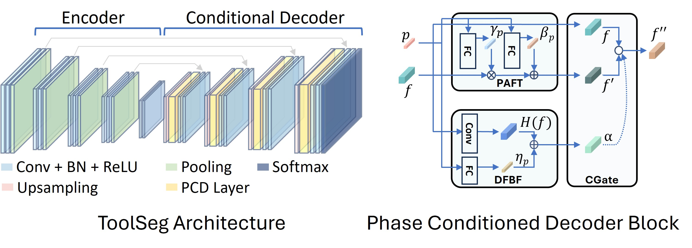

# 📄 Phase-Informed Tool Segmentation for Manual Small-Incision Cataract Surgery

This repository contains the official implementation of **ToolSeg**, our proposed method for phase-informed surgical tool segmentation in **Manual Small-Incision Cataract Surgery (MSICS)**.

Cataract surgery is one of the most common surgical procedures globally, yet most automated analysis methods have focused on Phacoemulsification, overlooking the widely used, low-cost MSICS technique. To bridge this gap, we introduce **Sankara-MSICS**, the first large-scale dataset for MSICS, featuring pixel-level annotations for 13 surgical tools across 18 phases in 53 surgery videos.

Our method, ToolSeg, enhances tool segmentation by:
- Leveraging surgical phase information via a novel **Phase-Conditional Decoder**.
- Incorporating a **semi-supervised learning strategy** with pseudo-labels generated by Meta’s SAM 2 foundation model.

ToolSeg achieves **state-of-the-art performance**, outperforming existing segmentation models on both the Sankara-MSICS and CaDIS datasets. This work aims to drive future advancements in cataract surgery automation, surgical skill analysis, and global eye care accessibility.

> 📢 **MICCAI 2025:** This work has been accepted for presentation at the **International Conference on Medical Image Computing and Computer-Assisted Intervention (MICCAI), 2025.**

---

## 🛠️ ToolSeg Architecture

ToolSeg is an encoder-decoder architecture with surgical phase conditioning to improve segmentation accuracy.



---

### To setup the environment

1. Create a new conda environment and activate it.
```bash
conda create -n toolseg python=3.12
conda activate toolseg
```

2. Install the required packages in the new environment.
```bash
conda install pytorch torchvision torchaudio pytorch-cuda=12.1 -c pytorch -c nvidia
pip install -r requirements.txt
```


### To download the dataset

Download the Sankara-MSICS dataset from [here](https://huggingface.co/datasets/SankaraEyeHospital/SankaraMSICS).

### To train the model

Make appropriate changes in `config.yaml` and run the following.
```bash
python main.py
```

Alternatively, you can override the parameters on the command line.
```bash
python main.py fold=0 condition.phase='pcd'
```

### To infer results based on pre-trained weights

Ensure the correct parameters are added in `config.yaml`.
```bash
python inference.py 
```